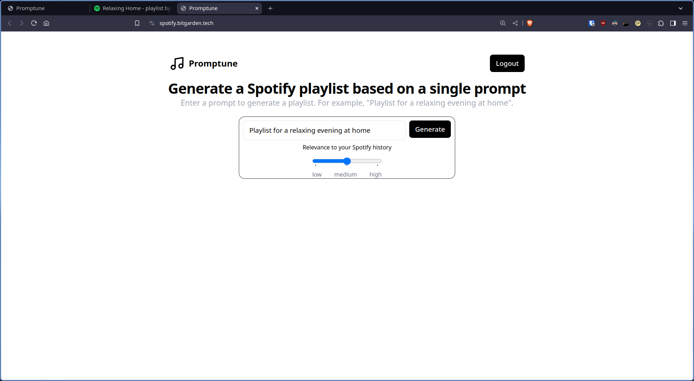
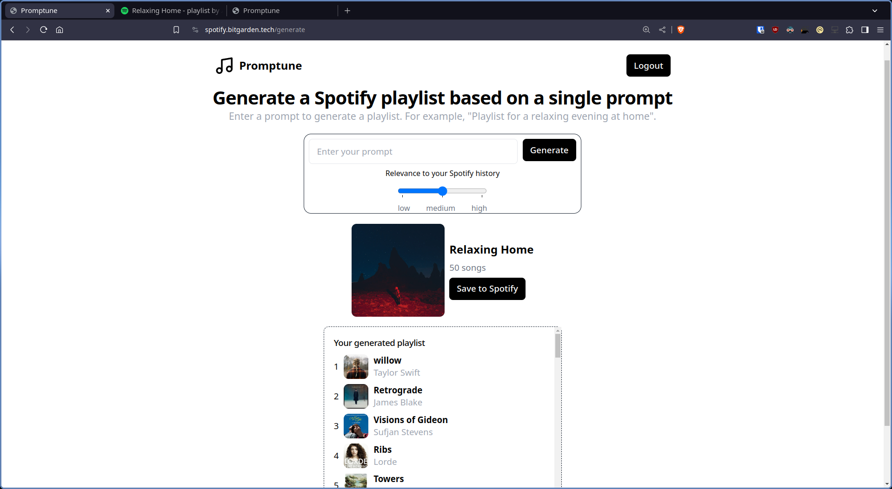
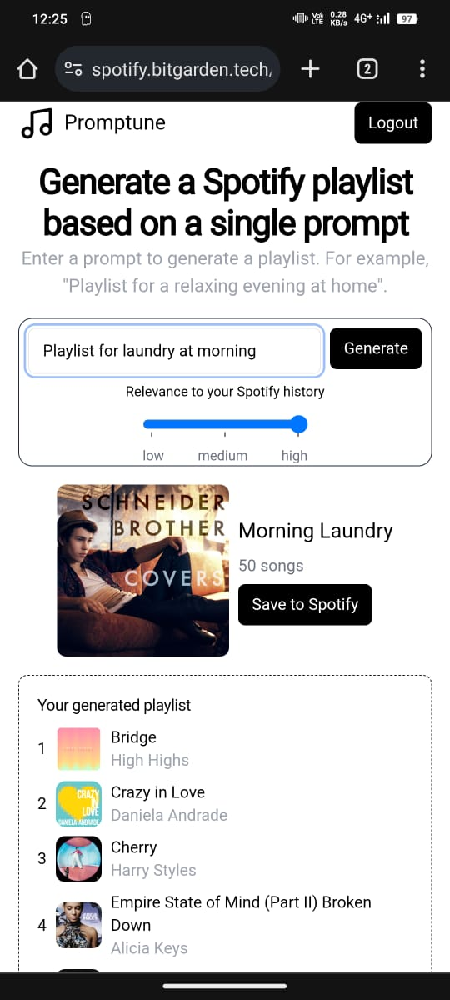
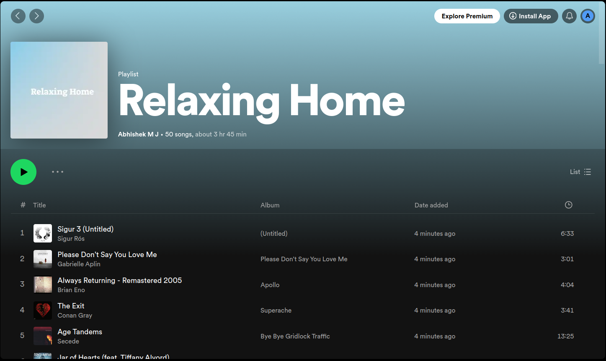
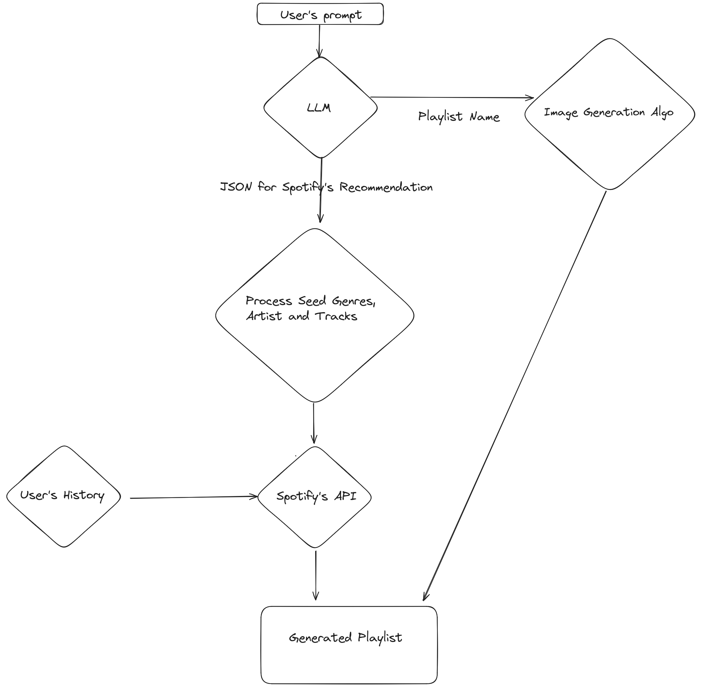

<h1 align="center" style="border-bottom: none">
    <b>
        <h2 href=""> Promptune </h2><br>
    </b>
    </hr>
</h1>

# [`Website link`](https://spotify.bitgarden.tech/)  [`Demo video link `](https://youtu.be/lFof-deyGEI)
Generate a Spotify playlist based on a single prompt. As simple as that.

## Team Details
`Team number` : VH250

| Name    | Email           |
|---------|-----------------|
| Abhishek MJ | cs21b2018@iiitdm.ac.in |
| M Sri Sujan | cs21b1081@iiitdm.ac.in |
| DSLR Siddesh | cs21b2019@iiitdm.ac.in |

<div style="display: flex; flex-wrap: wrap;">
    
    
    
    
     -->
</div>

## Problem statement 
Generate a Spotify playlist based on a single prompt
- In today's world, we are bombasted with an overwhelming amount of music choices. 
- Sometimes, we're not quite sure what we want to listen to. And we want a perfect playlist for some very niche scenarios like laundry morning, road trip with friends etc.
- We usually search for playlist in Spotify but they are not tuned for your music taste.


## About the project
Promptune, an innovative app designed to enhance your music listening experience by tailoring playlists to your mood and preferences.
- Promptune solves this problem by providing personalized playlists curated specifically for each user.
- Promptune uses large language model and spotify's api to analyse the user's promt and generate playlists that match it perfectly.
- Promptune takes into account your listening history on Spotify, ensuring that the playlists generated are tailored to your unique taste and preferences.

## Technical implemntaion 
The project is has 3 main steps:

1. Generating the Spotify Recommendation API's request JSON using LLM
   1. Also generate playlist name.
   2. Also generate 3 colors related to prompt
      1. Generate playlist cover image using Mesh Gradient Algorithm from above generated colors
2. Processing the seed_genres, seed_artists, seed_tracks from the JSON and replace with the actual Spotify's ID
3. Take top_artists and top_tracks from the user's Spotify account based on slider of relevance in UI
4. Making the request to Spotify's Recommendation API and getting the response
5. Use Spotify's API to create a playlist and add the tracks to it
6. Use Spotify's API to set the playlist cover image



## Techstacks used 
`Flask` , `Tailwind` , `llamma-70b` , `spotipy`

### Setup

```bash
pip install -r requirements.txt
```

```bash
npm install # node version 21.7.1
```

### Run

Setup the environment variables in a `.env` file
```bash
cp .env.sample .env
```

```bash
npx tailwindcss -i ./static/src/input.css -o ./static/dist/css/output.css
```

```bash
python app.py
```

# What's next ?
- The playlist cover can be purely AI generated using the prompt.
- Fine tuning the LLM model to generate better playlists.
- Adding more features like adding context using some user's own playlist
- Add an option to import the generated playlist to other platforms like Youtube Music, Apple Music etc.

## Declaration
We confirm that the project showcased here was either developed entirely during the hackathon or underwent significant updates within the hackathon timeframe. We understand that if any plagiarism from online sources is detected, our project will be disqualified, and our participation in the hackathon will be revoked.
